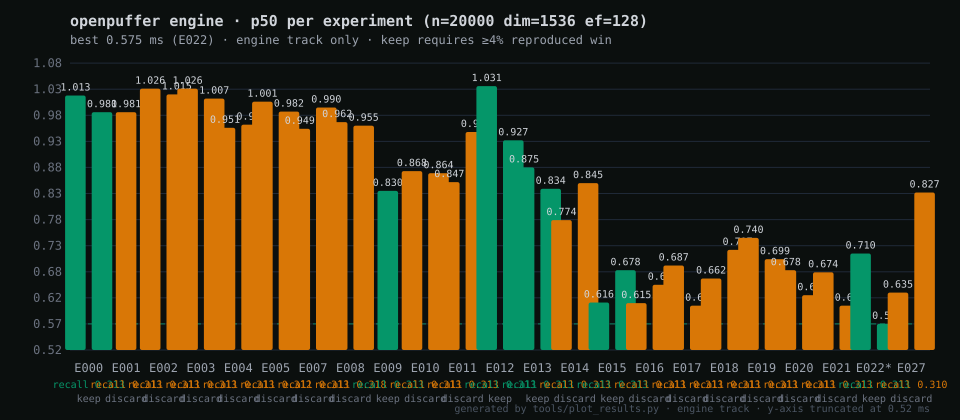

# openpuffer

An in-memory vector search engine written in Zig 0.17-dev — HNSW index with
int8-quantized traversal and exact f32 rerank — plus a **turbopuffer-compatible
HTTP server** with object-storage persistence, a benchmark harness that runs it
head-to-head against [turbopuffer](https://turbopuffer.com), and an
**autonomous optimization loop** in the style of
[karpathy/autoresearch](https://github.com/karpathy/autoresearch).

## Zig library

The in-process engine is a Zig module rooted at `src/lib.zig`. Dependents do
**not** pull HTTP serve, S3, or the CLI:

```sh
zig fetch --save git+https://github.com/justrach/openpuffer
```

```zig
// build.zig
const openpuffer_dep = b.dependency("openpuffer", .{
    .target = target,
    .optimize = optimize,
});
exe.root_module.addImport("openpuffer", openpuffer_dep.module("openpuffer"));
```

```zig
const std = @import("std");
const openpuffer = @import("openpuffer");

const Index = openpuffer.Hnsw(void);

pub fn main() !void {
    var gpa = std.heap.GeneralPurposeAllocator(.{}){};
    defer _ = gpa.deinit();
    const alloc = gpa.allocator();

    var idx = Index.init(alloc, 1536, .{});
    defer idx.deinit();

    const vec = [_]f32{1} ++ [_]f32{0} ** 1535;
    _ = try idx.insert(&vec);
    const hits = try idx.search(&vec, 10, 64, alloc);
    defer alloc.free(hits);
}
```

Memory knobs (same as the binary):

- `Options.store_f32 = false` (CLI `--no-f32`) skips the packed f32 slab; search
  is int8-only and `vector()` / `vectorConst()` are empty.
- `index.writeSlabs(path)` then `loaded.loadMmap(path)` demand-pages a snapshot
  (`MAP_PRIVATE` + heap append). `isMmapBacked()` is true after load.

Public surface: `Hnsw`, `Options`, `SearchResult`, and vector helpers
(`dot`, `cosineDistance`, `l2Norm`, `normalize`, `dotI8`).

## Engine highlights (`src/hnsw.zig`)

- HNSW index over f32 vectors, cosine distance (vectors L2-normalized on insert)
- int8-quantized graph traversal + exact f32 rerank (`searchAdvanced`'s
  `rerank_mult` is the recall/latency knob) — cuts memory traffic 4x at ≥1536 dims
- Explicit `@Vector(16)` dot-product reductions for SIMD without fast-math
- Heuristic neighbor selection with keep-pruned backfill (hnswlib-style)
- Per-layer visited sets (a shared set silently disconnects the graph)
- Optional `store_f32=false` / `--no-f32` drops the f32 slab (int8-only search)
- `loadMmap` reopens a slab snapshot with POSIX `MAP_PRIVATE` (demand-paged RSS)

## Server (`src/server.zig`) — drop-in turbopuffer API

`./zig-out/bin/openpuffer serve` exposes the local engine over the same HTTP
API shape as turbopuffer's v2 REST surface: write (`upsert_columns` /
`upsert_rows`), ANN query (`rank_by ["vector","ANN",[...]]`), stats, and
namespace delete. Persistence mirrors turbopuffer's architecture
(`src/persist.zig`): every write batch appends a WAL segment object to any
S3-compatible bucket (AWS S3 or Cloudflare R2 via `src/s3.zig`, SigV4),
snapshots compact consumed WAL entries, reads stay local and in-memory.

## Commands

```sh
zig build -Doptimize=ReleaseFast

# correctness tests
zig build test

# local ANN vs brute force on random vectors
./zig-out/bin/openpuffer bench-synthetic --n 20000 --queries 200 --dim 1536 --k 10 --ef 128

# full loop: Gemini embeddings -> build local HNSW AND upload to turbopuffer
# -> query both -> latency percentiles + recall@k against exact ground truth
export TURBOPUFFER_API_KEY=...
export GEMINI_API_KEY=...
./zig-out/bin/openpuffer bench-live --namespace openpuffer-bench-5 \
    --n 1000 --queries 40 --dim 1536 --k 10 --ef 256

# turbopuffer-compatible server (S3/R2 persistence via AWS_* env vars)
./zig-out/bin/openpuffer serve --port 8080 --bucket my-bucket
```

Options for both bench commands: `--n`, `--queries`, `--dim` (MRL output
dimensionality sent to Gemini), `--k`, `--ef`, `--namespace`, `--model`.

## Measured results (M1 Mac, gcp-us-central1 turbopuffer region)

### Head-to-head vs turbopuffer (live gemini-embedding-2 data, k=10)

| dataset | openpuffer p50 | openpuffer recall@10 | turbopuffer p50 | tpuf recall@10 | openpuffer speedup |
|---|---|---|---|---|---|
| 1000 × 1536, ef=256 | **0.72 ms** | 0.960 | 213 ms | 1.000 | ~295x latency |
| 1000 × 3072, ef=256 | **1.01 ms** | 0.965 | 216 ms | 1.000 | ~215x latency |

Caveat: openpuffer is an in-process library (no network hop), turbopuffer a cloud
service measured over WAN — the multiple reflects access model as much as
engine. The apples-to-apples local comparison:

### Local: openpuffer ANN (int8 traversal + f32 rerank) vs exact brute-force scan

| dataset | openpuffer p50 | exact scan p50 | speedup | recall@10 |
|---|---|---|---|---|
| 20k × 1536 random, ef=128 | **1.08 ms** | 3.38 ms | 3.1x | 0.313* |
| 20k × 3072 random, ef=128 | **1.60 ms** | 5.43 ms | 3.4x | 0.272* |
| 1000 × 1536 live embeddings, ef=256 | **0.72 ms** | ~6 ms† | ~8x | 0.960 |

\* uniformly random high-dim vectors are the worst case for ANN — real
embedding space clusters and lands at 0.95+.
\† extrapolated from scan throughput at that scale.

## Autonomous optimization loop

This repo runs an autoresearch-style experiment loop ([`program.md`](program.md)):
an agent proposes ONE change at a time to `src/hnsw.zig` / `src/vector.zig`,
gates it on `zig build test`, measures it with the fixed `bench-synthetic`
command above, and keeps it only if p50 improves ≥4% reproduced (run-to-run
noise here is ±3%). Everything lands in the append-only ledger at
[`experiments/log.md`](experiments/log.md), rendered live by
`tools/plot_results.py`:



### Findings so far

- **E001** dry-run validated the cycle mechanics end-to-end.
- **E002/E003** widening the int8 dot product from 16 to 64 lanes (two
  formulations): *neutral* on M1 NEON — the 16-lane lowering was already near
  the hardware's widening-multiply throughput.
- **E004/E005** flattening the quantized pool + eliminating per-query
  allocations: measured wins evaporated under controlled comparison — at this
  scale the cost is distance evaluations, not memory layout or allocator churn.
- **E005 bonus**: found and fixed a mixed-allocator ownership bug (scratch grown
  under a caller arena, freed under the index's allocator → invalid free).
- Meta-lesson: the ±3% noise floor vs 4% keep bar has rejected every
  "obvious" optimization so far — exactly what it exists to do. Remaining
  headroom is fewer/faster distance evaluations, not micro-layout.
- **E006** (peer-run) simplified quantized scoring to a monotonic f32 form;
  correctly discarded without a measurement when the benchmark could not run.

## Layout

- `src/lib.zig` — public module root (`@import("openpuffer")`; no HTTP serve)
- `src/vector.zig` — SIMD dot product / cosine distance / normalization
- `src/hnsw.zig` — HNSW index (+ connectivity/recall unit tests)
- `build.zig.zon` — Zig package manifest for in-process dependents
- `src/server.zig` — turbopuffer-compatible HTTP API over the local engine
- `src/persist.zig` — WAL-segment + snapshot persistence to object storage
- `src/s3.zig` — minimal S3/R2 SigV4 client
- `src/gemini.zig` — `batchEmbedContents` client (RETRIEVAL_DOCUMENT/QUERY task types)
- `src/tpuf.zig` — turbopuffer v2 REST client (`upsert_columns`, ANN `query`)
- `src/main.zig` — CLI + benchmark harness
- `program.md` — the autonomous research protocol (point any coding agent at it)
- `experiments/` — append-only results ledger + generated chart
- `tools/plot_results.py` — regenerates `experiments/results.svg` from the ledger
- `train.py` — reference copy of karpathy/autoresearch's training script (MIT),
  vendored as the pattern's source material

## Credits & license

The autonomous-loop design follows
[karpathy/autoresearch](https://github.com/karpathy/autoresearch); `train.py`
is cherry-picked from [nanochat](https://github.com/karpathy/nanochat) (MIT).
MIT licensed — see [LICENSE](LICENSE).
